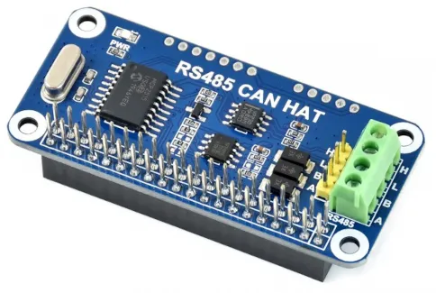

Example j1939 with Rust
===

Experiments in reading j1939 from can bus using socketcan and canparse.

## hardware
- Waveshare RS485/CAN hat



- overlay activation @ `/boot/config.txt`
```text
[all]
dtoverlay=mcp2515-can0,oscillator=12000000,interrupt=25,spimaxfrequency=2000000
```


## socketcan iface
- https://www.pragmaticlinux.com/2021/10/can-communication-on-the-raspberry-pi-with-socketcan/

```shell
modprobe can
modprobe can_raw
ip link set can0 type can bitrate 250000 restart-ms 100
ip link set up can0
```

check interface with `ip addr`
```text
4: can0: <NOARP,UP,LOWER_UP,ECHO> mtu 16 qdisc pfifo_fast state UP group default qlen 10
    link/can
```

## references
- https://github.com/jmagnuson/canparse
- https://github.com/dankamongmen/canscan
- https://github.com/mbr/socketcan-rs
- https://www.kvaser.com/developer-blog/an-introduction-j1939-and-dbc-files
- https://www.csselectronics.com/pages/j1939-explained-simple-intro-tutorial
- https://www.autopi.io/blog/j1939-explained/
- http://socialledge.com/sjsu/index.php/DBC_Format

## tools
- https://www.csselectronics.com/pages/j1939-pgn-conversion-tool
- https://github.com/CSS-Electronics/mdf4-converters

## sample data
- https://github.com/CSS-Electronics/mdf4-converters
- https://canlogger.csselectronics.com/canedge-getting-started/log-file-tools/
  - @ `data/sample-can-data.zip`

```shell
mdf2socketcan -i LOG/958D2219/00002501/00002081.MF4 -O /tmp/can
canplayer -v -g 1000 -I /tmp/can/00002081_CAN.log vcan0=can0
```

## cross compile

```shell
rustup target add armv7-unknown-linux-gnueabihf
sudo apt install gcc-arm-linux-gnueabihf
```

The following entry is in the Cargo config toml

```toml
[target.armv7-unknown-linux-gnueabihf]
linker = "arm-linux-gnueabihf-gcc"
```

https://doc.rust-lang.org/cargo/reference/config.html

```shell
cargo build --target=armv7-unknown-linux-gnueabihf
```
